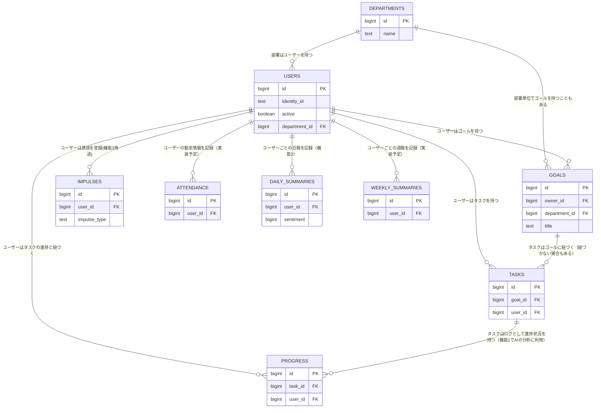

## プロジェクト概要
The Motivation Trackerは目標達成に向けたタスクと、タスク遂行の鍵となるモチベーションを管理するためのアプリです。

仕事や趣味でより高みを目指すとき、モチベーションは結果に直結する要素です。
モチベーションが維持できない要因として、以下の点が挙げられます。

- 課題1. 目標を意識できていない、忘れてしまう
- 課題2. 目標に対するスモールステップを整理できていない
- 課題3. 達成したスモールステップを追えず、進んでいる実感がない（日報など記録する仕組みがない）
- 課題4. メンタル面の管理ができていない
- 課題5. 誘惑に負けて別のことにかまけてしまう
<br>

このアプリでは、上記の課題を解決するための機能を提供します。

## アプリの機能


アプリでは上記の課題に対応するための**3つの機能**を提供します。
### 機能1. 目標とタスク管理（課題1, 2への対応）
目標とそれに紐づくタスクを登録し、やるべきことを常に把握できるようにします。<br>
手をつけたタスクに進捗を記入し、進捗データを保存します。<br>
完了したタスクは非表示化でき、進捗データとして記録されます。

### 機能2. 進捗分析（課題3, 4への対応）
機能1で記入した進捗をもとに、日報をAIにより作成し表示します。<br>
日報は5段階のセンチメント分析を含み、ページ上部に時系列でプロットされます
（メンタルの落ち込みが続くと、登録されたメールアドレス宛に発報する機能を実装予定です）。<br>
期間で表示の絞り込みができ、直近一週間、今月、全ての3パターンが可能です。

### 機能3. 誘惑回避（課題5への対応）
モチベーションの大敵である誘惑に負けそうなとき、自分に喝を入れるためのオリジナルmeme（ミーム）を登録、表示できます。<br>
「お酒」、「サボり」、「その他の煩悩」の三つの欲でジャンル分けして登録することができます。<br>
登録したmemeはランダムに表示されます。


## 技術スタックと工夫点
### 使用した技術スタック一覧
- フロントエンドフレームワーク: React
- CSSフレームワーク: TailwindCSS
- サーバーランタイム: Node.js
- アプリケーション基盤: Docker
- データベース: Supabase
- CI/CD: GitHub Actions
- インフラ: Oracle Cloud Infrastructure
    - IaaS
        - Virtual Cloud Networkと各種ゲートウェイ
        - Load Balancer
        - Compute Instance
        - Public/Private DNS
        - Object Storage
    - IdP: Identity Domains
    - Edge Security: Web Application Firewall
- その他: OpenAI API


### 工夫点1: 安全性
認証基盤をIdentity Domains (OAuth 2.0準拠) に委任することでユーザーの名前や連絡先などの**秘匿性の高い情報をデータベースに保持していません。**
- クライアントはIDなどのトークンをHttpOnly Cookieとして保持し、一定期間だけログイン状態を維持
- Next.jsのmiddleware.tsを通じて、bearerトークンの有効性をIntrospectionで検証します。<br>

また、脆弱性攻撃への対策としてWAFを利用してOWASP Top10などの脆弱性攻撃をエッジ (Edge) で遮断しています。

通信の流れは以下の通りです。
- 通信0: （キャッシュがない場合）クライアントからパブリックDNSに問い合わせし、コンピュート・インスタンスのパブリックIPアドレスを取得
- 通信1: Load Balancerが通信をプロキシする（**不正な通信はWAFで遮断**）
- 通信2: コンピュート・インスタンス上のAppコンテナへ接続
- 通信3, 4: 
    - 初回はIdentity Domainsへリダイレクトして認証
    - 以降はCookieを元にユーザー情報をサーバーで問い合わせ（**随時Introspectionでセッションの有効性も確認**）
- 通信5, 6: 受け取ったユーザーIDなどをもとにサーバーからSupabaseやOpenAI APIへリクエスト
- 通信7, 8: アプリのレスポンスを、Load Balancerでプロキシし、クライアントへ返却する


### 工夫点2: 将来的な拡張性を考慮したインフラ設計
ユーザー数が増えたり、一部のアプリとインフラの変更があっても大規模な作り直しが必要ないように意識して設計しました。特に以下の点がポイントです。

- 基盤の変更やスケールアウトをしやすいようにAppサーバーをコンテナ化
- オブジェクト・ストレージやデータベースを利用しコンピュート・インスタンスでのデータをステートレス化（腹持ち回避）
- リバースプロキシとしてLoad Balancerをアプリの前に配置することでAppコンテナがスケールアウトしてもアプリを書き換え不要に

### 工夫点3: 将来的な拡張性やデータ変更を考慮したデータ設計
データベースの各テーブルを役割ごとに分離することで、将来的な機能拡張による改修を最小限に抑えられるように工夫しました。
例えば、テーブル間に以下のような階層構造を持たせることで、将来的に実装予定であるゴールの部署内共有機能やユーザーによるデータ変更が入っても、**一つのテーブルの一部のみへの更新に留める設計**にしています。<br>
```
Goal
  └─ Task
       └─ Progress
```




### 工夫点4: メンテナンスとトラブル時の原因切り分けを想定したアプリ設計
同じ操作をモジュール化したりデータベースの変更を伴う処理をAPI化することで、役割分担を明確化し、メンテナンスやトラブル時の原因切り分けがしやすいように意識しました。

@/authフォルダ配下
- callback: Identity Domainsで認証後にcookieをクライアントにsetする
- logout_callback: Identity Domainsからのログアウト後にリダイレクトされてクライアントのcookieを削除

@/apiフォルダ配下
- addProgress: 入力したタスクの進捗をデータベースに登録
- uploadImage: 誘惑回避meme画像をオブジェクト・ストレージにアップロード
- dailySummaryBatch: AI日報作成のための日次バッチ処理のためのPOSTリクエストを受ける本体

など

@/libフォルダ配下
- analyzeMotivation: dailySummaryBatchで整形されたデータをもとにOpenAI APIへリクエスト
- getAppUsers: Identity Domainsからユーザー情報の取得
- supabaseClients/Servers: Supabaseオブジェクトの作成

@/middleware.tsx：ユーザー認証の状態をクッキーをもとにチェックし、遷移先URLを設定する<br>
@/page.tsx: ルートへのアクセス時のリダイレクト先を指定<br>
@/layout.tsx: ユニバーサルなログイン時の画面表示<br>
@/uiフォルダ: layout.tsxの外枠として、以下のアプリ機能を中心としたサイドメニューの表示（レスポンシブ対応済）<br>
@/homeフォルダ: アプリ機能1<br>
@/analyticsフォルダ: アプリ機能2<br>
@/controlフォルダ: アプリ機能3<br>
@/loginフォルダ: ログイン機能<br>
@/logoutフォルダ: ログアウトボタン機能<br>

## 免責
※ コードを含めて投稿内容は個人の見解であり、所属する組織と一切の関係がありません。また、本コードを利用に起因するすべての責任を負いません。